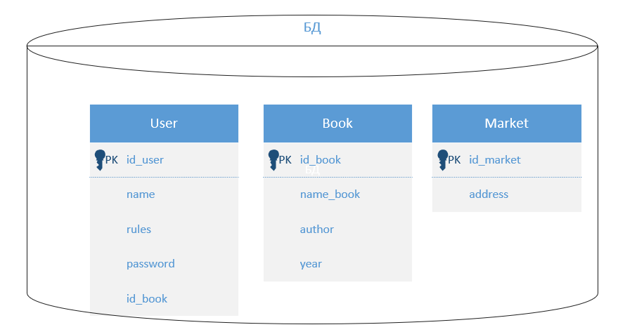
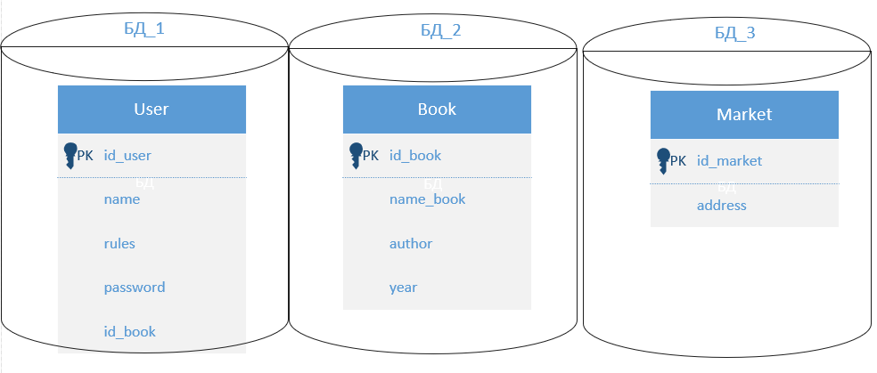
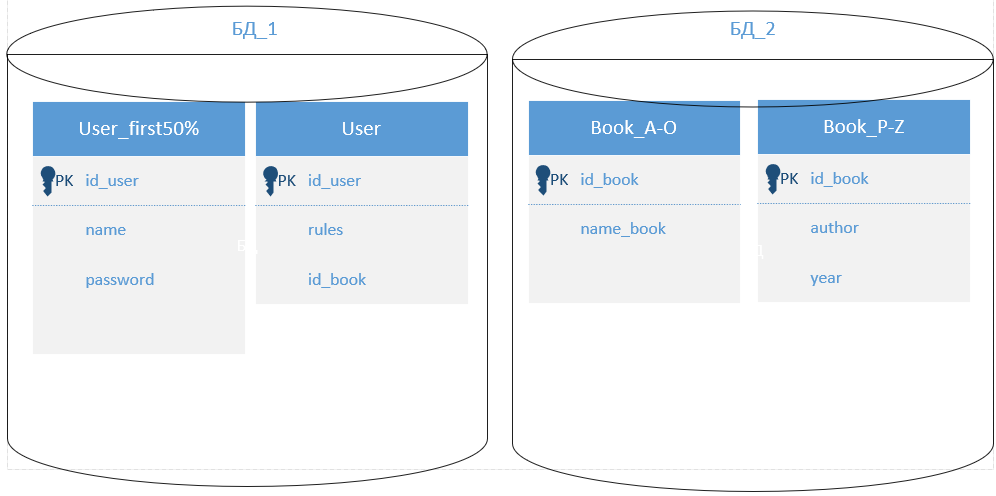

# Домашнее задание к занятию 12.7. «Репликация и масштабирование. Часть 2» - Серебряков Руслан

### Задание 1

Опишите основные преимущества использования масштабирования методами:

- активный master-сервер и пассивный репликационный slave-сервер; 
- master-сервер и несколько slave-серверов;
- активный сервер со специальным механизмом репликации — distributed replicated block device (DRBD);
- SAN-кластер.

*Дайте ответ в свободной форме.*

---
- активный master-сервер и пассивный репликационный slave-сервер; 
Этот метод масштабирования реализуется путём добавления дополнительных серверов которые только постоянно (или периодически) копирут информацию с master-сервера.
Таким образом повышается надёжность самой базы данных т.к. если master упадёт, то можно сконфигурировать одного из slave-серверов в нового master. 

- master-сервер и несколько slave-серверов;
Этот метод масштабирования реализуется так-же как и предыдущий. Но (как я понял) в данном методе slave серверы могут отдавать информацию, а это снижает нагрузку на mastera т.к. ему приходится отвечать на меньшее количество запросов. Этот метод может повысить отказоустойчивость и производительность БД в целом =).

- активный сервер со специальным механизмом репликации — distributed replicated block device (DRBD);
Я это понял следубщим образом - по сути это активный master-сервер с который за счет DRBD делает копию БД на другом сервере. (т.е. грубо говоря - периодически делает backup).

- SAN-кластер.
Следуя описанию из лекции - SAN расшифровывается как "Storage Area Network", это когда мы создаём кластер серверов с нашей БД. Имеет множество преимуществ перед обычными (одиночными) серверами. Например - высокая надёжность, более высокая производительность всей системы в целом.

### Задание 2

Разработайте план для выполнения горизонтального и вертикального шаринга базы данных. База данных состоит из трёх таблиц: 

- пользователи, 
- книги, 
- магазины (столбцы произвольно). 

Опишите принципы построения системы и их разграничение или разбивку между базами данных.

*Пришлите блоксхему, где и что будет располагаться. Опишите, в каких режимах будут работать сервера.* 

Таблицы в базе

Вертикальный шардинг

Горизонтальный шардинг

## Дополнительные задания (со звёздочкой*)
Эти задания дополнительные, то есть не обязательные к выполнению, и никак не повлияют на получение вами зачёта по этому домашнему заданию. Вы можете их выполнить, если хотите глубже шире разобраться в материале.

---
### Задание 3*

Выполните настройку выбранных методов шардинга из задания 2.

*Пришлите конфиг Docker и SQL скрипт с командами для базы данных*.

